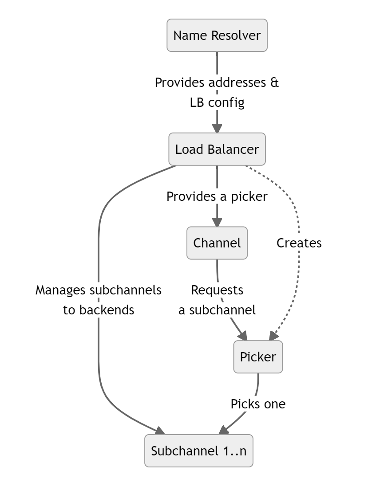

+++
title = "自定义负载均衡策略"
weight = 4
date = 2023-05-31T10:45:26+08:00
description = ""
isCJKLanguage = true
draft = false

+++

# Custom Load Balancing Policies 自定义负载均衡策略

https://grpc.io/docs/guides/custom-load-balancing/

Explains how custom load balancing policies can help optimize load balancing under unique circumstances.

解释了如何使用自定义负载均衡策略在特定情况下优化负载均衡。

### Overview 概述

One of the key features of gRPC is load balancing, which allows requests from clients to be distributed across multiple servers. This helps prevent any one server from becoming overloaded and allows the system to scale up by adding more servers.

gRPC的关键功能之一是负载均衡，它允许来自客户端的请求分布到多个服务器上。这有助于防止任何一个服务器过载，并允许通过添加更多服务器来扩展系统。

A gRPC load balancing policy is given a list of server IP addresses by the name resolver. The policy is responsible for maintaining connections (subchannels) to the servers and picking a connection to use when an RPC is sent.

gRPC负载均衡策略由名称解析器提供一个服务器IP地址列表。该策略负责维护与服务器的连接（子通道），并在发送RPC时选择要使用的连接。

### Implementing Your Own Policy 实现自定义策略

By default the `pick_first` policy will be used. This policy actually does no load balancing but just tries each address it gets from the name resolver and uses the first one it can connect to. By updating the gRPC service config you can also switch to using `round_robin` that connects to every address it gets and rotates through the connected backends for each RPC. There are also some other load balancing policies available, but the exact set varies by language. If the built-in policies do not meet your needs you can also implement you own custom policy.

默认情况下，将使用`pick_first`策略。该策略实际上不进行负载均衡，只是尝试连接名称解析器获取的每个地址，并使用其中第一个可连接的地址。通过更新gRPC服务配置，还可以切换到使用`round_robin`策略，该策略连接获取到的每个地址，并为每个RPC在已连接的后端之间进行轮询。还提供了其他一些负载均衡策略，但具体的可用策略因语言而异。如果内置的策略无法满足您的需求，您还可以实现自定义策略。

This involves implementing a load balancer interface in the language you are using. At a high level, you will have to:

这涉及在您使用的语言中实现一个负载均衡器接口。在高层上，您需要：

- Register your implementation in the load balancer registry so that it can be referred to from the service config
- Parse the JSON configuration object of your implementation. This allows your load balancer to be configured in the service config with any arbitrary JSON you choose to support
- Manage what backends to maintain a connection with
- Implement a `picker` that will choose which backend to connect to when an RPC is made. Note that this needs to be a fast operation as it is on the RPC call path
- To enable your load balancer, configure it in your service config
- 在负载均衡器注册表中注册您的实现，以便可以从服务配置中引用它
- 解析您的实现的JSON配置对象。这允许您的负载均衡器在服务配置中以您选择支持的任意JSON进行配置
- 管理要与之保持连接的后端
- 实现一个`picker`，在进行RPC调用时选择要连接的后端。请注意，这必须是一个快速的操作，因为它在RPC调用路径上进行
- 要启用您的负载均衡器，请在服务配置中进行配置

The exact steps vary by language, see the language support section for some concrete examples in your language.

具体的步骤因语言而异，请参阅语言支持部分，了解您所使用的语言中的一些具体示例。

### Backend Metrics 后端指标

What if your load balancing policy needs to know what is going on with the backend servers in real-time? For this you can rely on backend metrics. You can have metrics provided to you either in-band, in the backend RPC responses, or out-of-band as separate RPCs from the backends. Standard metrics like CPU and memory utilization are provided but you can also implement your own, custom metrics.

如果您的负载均衡策略需要实时了解后端服务器的情况怎么办？为此，您可以依赖后端指标。您可以通过内部通道，在后端RPC响应中提供指标，或者作为来自后端的单独RPC进行提供。提供了标准指标，如CPU和内存利用率，但您也可以实现自己的自定义指标。

For more information on this, please see the custom backend metrics guide (TBD)

有关详细信息，请参阅自定义后端指标指南（待定）。

### Service Mesh 服务网格

If you have a service mesh setup where a central control plane is coordinating the configuration of your microservices, you cannot configure your custom load balancer directly via the service config. But support is provided to do this with the xDS protocol that your control plane uses to communicate with your gRPC clients. Please refer to your control plane documentation to determine how custom load balancing configuration is supported.

如果您设置了一个服务网格，其中一个中央控制平面协调您的微服务的配置，您不能直接通过服务配置来配置您的自定义负载均衡器。但是，通过xDS协议提供了支持，该协议是您的控制平面用于与gRPC客户端通信的。请参阅您的控制平面文档，了解如何支持自定义负载均衡配置。

For more details, please see gRPC [proposal A52](https://github.com/grpc/proposal/blob/master/A52-xds-custom-lb-policies.md).

有关详细信息，请参阅gRPC的[提案A52](https://github.com/grpc/proposal/blob/master/A52-xds-custom-lb-policies.md)。

### Language Support 语言支持

| 语言 | 示例                                                         | 注释                  |
| ---- | ------------------------------------------------------------ | --------------------- |
| Java | [Java 示例](https://github.com/grpc/grpc-java/tree/master/examples/src/main/java/io/grpc/examples/customloadbalance) |                       |
| Go   |                                                              | 示例和xDS支持即将推出 |
| C++  |                                                              | 尚未支持              |