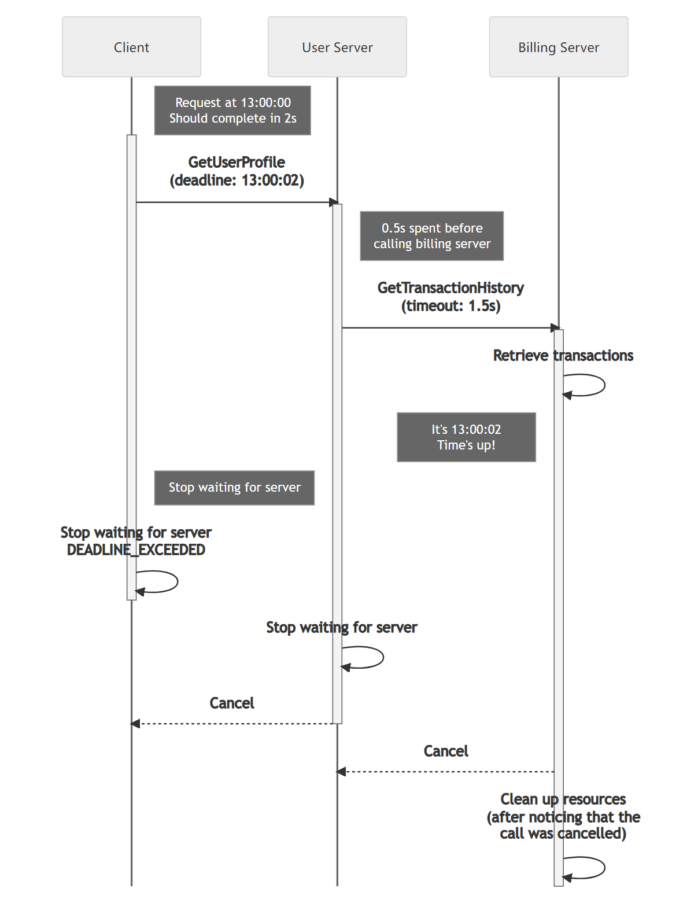

+++
title = "截止时间"
weight = 5
date = 2023-05-31T10:45:43+08:00
description = ""
isCJKLanguage = true
draft = false
+++

# Deadlines 截止时间

https://grpc.io/docs/guides/deadlines/

Explains how deadlines can be used to effectively deal with unreliable backends.

解释了如何使用截止时间有效地处理不可靠的后端。

### Overview 概述

A deadline is used to specify a point in time past which a client is unwilling to wait for a response from a server. This simple idea is very important in building robust distributed systems. Clients that do not wait around unnecessarily and servers that know when to give up processing requests will improve the resource utilization and latency of your system.

截止时间用于指定客户端在此时间点之后不愿意等待来自服务器的响应。这个简单的概念在构建健壮的分布式系统中非常重要。不必要地等待的客户端和知道何时放弃处理请求的服务器将改善系统的资源利用率和延迟。

Note that while some language APIs have the concept of a **deadline**, others use the idea of a **timeout**. When an API asks for a deadline, you provide a point in time which the request should not go past. A timeout is the max duration of time that the request can take. For simplicity, we will only refer to deadline in this document.

请注意，尽管某些语言的API中有**截止时间**的概念，但其他语言使用**超时**的概念。当API要求截止时间时，您提供了请求不应超过的时间点。超时是请求可以花费的最长时间。为了简单起见，本文档中将仅使用截止时间一词。

### Deadlines on the Client 客户端的截止时间

By default, gRPC does not set a deadline which means it is possible for a client to end up waiting for a response effectively forever. To avoid this you should always explicitly set a realistic deadline in your clients. To determine the appropriate deadline you would ideally start with an educated guess based on what you know about your system (network latency, server processing time, etc.), validated by some load testing.

默认情况下，gRPC不设置截止时间，这意味着客户端有可能无限期地等待响应。为了避免这种情况，您应该始终在客户端显式设置一个合理的截止时间。为确定适当的截止时间，您应该根据对系统的了解（网络延迟、服务器处理时间等）进行有根据的猜测，并通过一些负载测试进行验证。

If a server has gone past the deadline when processing a request, the client will give up and fail the RPC with the `DEADLINE_EXCEEDED` status.

如果服务器在处理请求时超过了截止时间，客户端将放弃并以“DEADLINE_EXCEEDED”状态失败该RPC。

### Deadlines on the Server 服务器的截止时间

A server might receive requests from a client with an unrealistically short deadline that would not give the server enough time to ever respond in time. This would result in the server just wasting valuable resources and in the worst case scenario, crash the server. A gRPC server deals with this situation by automatically cancelling a call (`CANCELLED` status) once a deadline set by the client has passed.

服务器可能会接收到具有不切实际短截止时间的客户端请求，这将不给服务器足够的时间来及时响应。这将导致服务器浪费宝贵的资源，并且在最坏的情况下可能导致服务器崩溃。gRPC服务器通过在客户端设置的截止时间过去后自动取消调用（“CANCELLED”状态）来处理这种情况。

Please note that the server application is responsible for stopping any activity it has spawned to service the request. If your application is running a long-running process you should periodically check if the request that initiated it has been cancelled and if so, stop the processing.

请注意，服务器应用程序负责停止为服务请求而产生的任何活动。如果您的应用程序运行了一个长时间运行的进程，您应该定期检查是否已取消发起该进程的请求，如果是，则停止处理。

#### Deadline Propagation 截止时间传播

Your server might need to call another server to produce a response. In these cases where your server also acts as a client you would want to honor the deadline set by the original client. Automatically propagating the deadline from an incoming request to an outgoing one is supported by some gRPC implementations. In some languages this behavior needs to be explicitly enabled (e.g. C++) and in others it is enabled by default (e.g. Java and Go). Using this capability lets you avoid the error-prone approach of manually including the deadline for each outgoing RPC.

您的服务器可能需要调用另一个服务器来生成响应。在这些情况下，当您的服务器充当客户端时，您希望遵守原始客户端设置的截止时间。一些gRPC实现支持自动将来自传入请求的截止时间传播到传出请求。在某些语言中，需要显式启用此行为（例如C++），而在其他语言中，它默认启用（例如Java和Go）。使用此功能可以避免手动为每个传出的RPC单独包含截止时间的错误做法。

Since a deadline is set point in time, propagating it as-is to a server can be problematic as the clocks on the two servers might not be synchronized. To address this gRPC converts the deadline to a timeout from which the already elapsed time is already deducted. This shields your system from any clock skew issues.

由于截止时间是设置的一个时间点，直接将其传播给服务器可能会有问题，因为两个服务器上的时钟可能不同步。为解决这个问题，gRPC将截止时间转换为已经过去的超时时间。这样可以避免系统受到任何时钟偏差问题的影响。

### 语言支持

| 语言   | 示例                                                         |
| ------ | ------------------------------------------------------------ |
| Java   | [Java 示例](https://github.com/grpc/grpc-java/tree/master/examples/src/main/java/io/grpc/examples/deadline) |
| Go     | [Go 示例](https://github.com/grpc/grpc-go/tree/master/examples/features/deadline) |
| C++    |                                                              |
| Python | [Python 示例](https://github.com/grpc/grpc/tree/master/examples/python/timeout) |

### 其他资源

- [截止时间博文](https://grpc.io/blog/deadlines/)