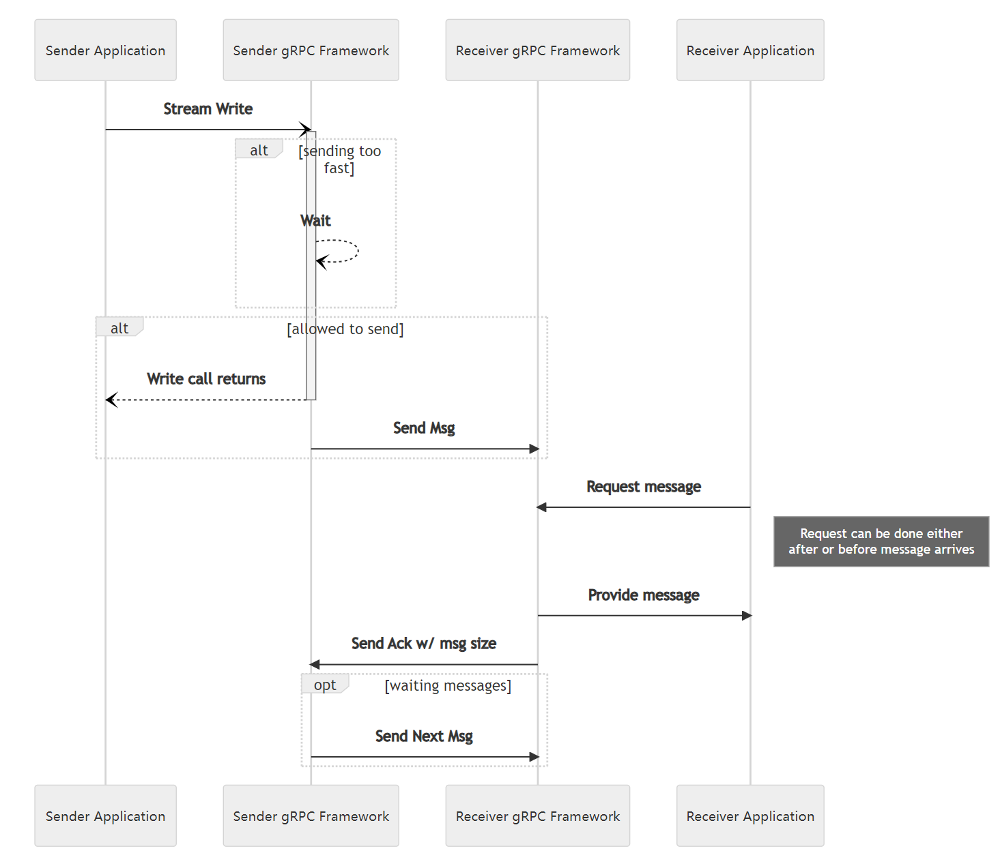

+++
title = "流量控制"
weight = 7
date = 2023-05-31T10:46:11+08:00
description = ""
isCJKLanguage = true
draft = false
+++

# Flow Control  流量控制

https://grpc.io/docs/guides/flow-control/

Explains what flow control is and how you can manually control it.

解释了什么是流量控制，以及如何手动控制流量。

### Overview 概述

Flow control is a mechanism to ensure that a receiver of messages does not get overwhelmed by a fast sender. Flow control prevents data loss, improves performance and increases reliability. It applies to streaming RPCs and is not relevant for unary RPCs. By default, gRPC handles the interactions with flow control for you, though some languages allow you to take override the default behavior and take explicit control.

流量控制是一种机制，确保消息的接收方不会被快速发送方压垮。流量控制可以防止数据丢失，提高性能和可靠性。它适用于流式RPC，并且对于一元RPC来说不相关。默认情况下，gRPC会为您处理流量控制的交互，但某些语言允许您覆盖默认行为并显式控制。

gRPC utilizes the underlying transport to detect when it is safe to send more data. As data is read on the receiving side, an acknowledgement is returned to the sender letting it know that the receiver has more capacity.

gRPC利用底层传输来检测何时可以安全地发送更多数据。当在接收端读取数据时，会向发送方返回确认，告知接收方还有更多的容量。

As needed, the gRPC framework will wait before returning from a write call. In gRPC, when a value is written to a stream, that does not mean that it has gone out over the network. Rather, that it has been passed to the framework which will now take care of the nitty gritty details of buffering it and sending it to the OS on its way over the network.

根据需要，gRPC框架将在写入调用返回之前等待。在gRPC中，当将值写入流时，并不意味着它已经通过网络发送出去。相反，它已经传递给框架，框架将负责处理细节，对其进行缓冲并将其发送到操作系统以便通过网络发送。

#### Note 注意

The flow is the same for writing from a Server to a Client as when a Client writes to a Server

从服务器向客户端写入的流程与客户端向服务器写入的流程相同。

#### Warning 警告

There is the potential for a deadlock if both the client and server are doing synchronous reads or using manual flow control and both try to do a lot of writing without doing any reads. 

如果客户端和服务器都在进行同步读取或使用手动流量控制，并且都试图在不进行任何读取的情况下进行大量写入，可能会导致死锁。

### 语言支持

| 语言 | 示例                                                         |
| ---- | ------------------------------------------------------------ |
| Java | [Java示例](https://github.com/grpc/grpc-java/tree/master/examples/src/main/java/io/grpc/examples/manualflowcontrol) |

