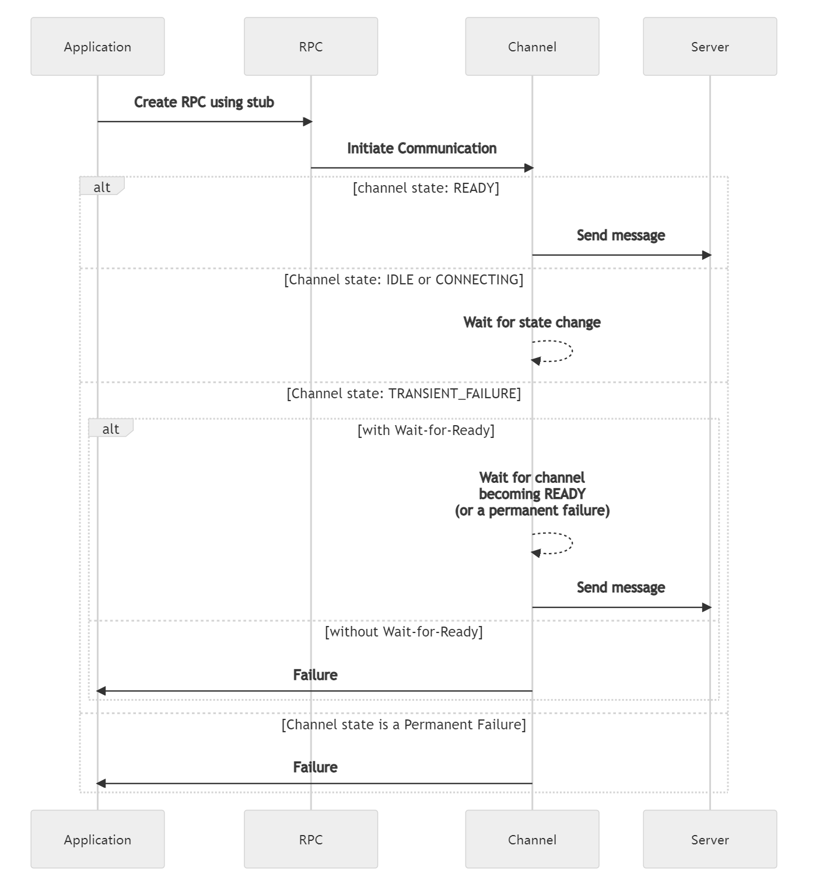
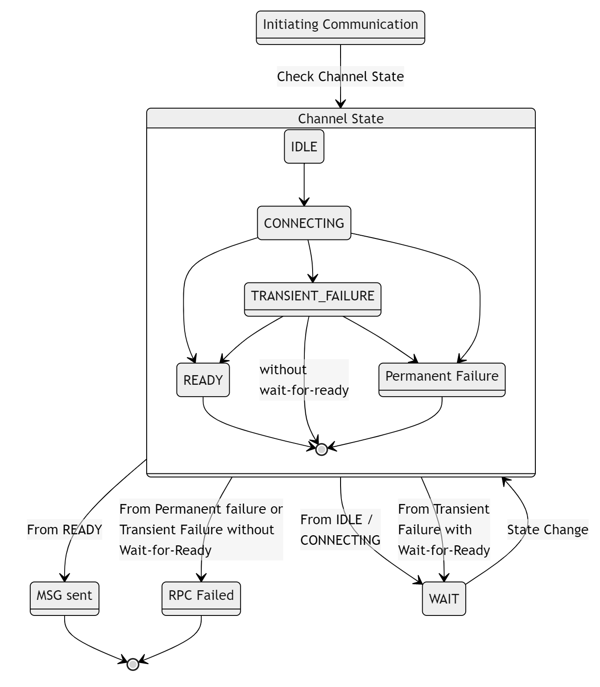

+++
title = "wait-for-ready"
date = 2023-05-31T10:47:45+08:00
description = ""
isCJKLanguage = true
draft = false
+++

# Wait-for-Ready

https://grpc.io/docs/guides/wait-for-ready/

Explains how to configure RPCs to wait for the server to be ready before sending the request.

### Overview

This is a feature which can be used on a stub which will cause the RPCs to wait for the server to become available before sending the request. This allows for robust batch workflows since transient server problems won’t cause failures. The deadline still applies, so the wait will be interrupted if the deadline is passed.

When an RPC is created when the channel has failed to connect to the server, without Wait-for-Ready it will immediately return a failure; with Wait-for-Ready it will simply be queued until the connection becomes ready. The default is **without** Wait-for-Ready.

For detailed semantics see [this](https://github.com/grpc/grpc/blob/master/doc/wait-for-ready.md).

### How to use Wait-for-Ready

You can specify for a stub whether or not it should use Wait-for-Ready, which will automatically be passed along when an RPC is created.

#### Note

The RPC can still fail for other reasons besides the server not being ready, so error handling is still necessary.

The following shows the sequence of events that occur, when a client sends a message to a server, based upon channel state and whether or not Wait-for-Ready is set.

The following is a state based view

### Alternatives

- Loop (with exponential backoff) until the RPC stops returning transient failures.
  - This could be combined, for efficiency, with implementing an `onReady` Handler *(for languages that support this)*.
- Accept failures that might have been avoided by waiting because you want to fail fast

### Language Support

| Language | Example                                                      |
| -------- | ------------------------------------------------------------ |
| Java     | [Java example](https://github.com/grpc/grpc-java/blob/master/examples/src/main/java/io/grpc/examples/waitforready/WaitForReadyClient.java) |
| Go       | [Go example](https://github.com/grpc/grpc-go/tree/master/examples/features/name_resolving) |
| Python   | [Python example](https://github.com/grpc/grpc/tree/master/examples/python/wait_for_ready) |